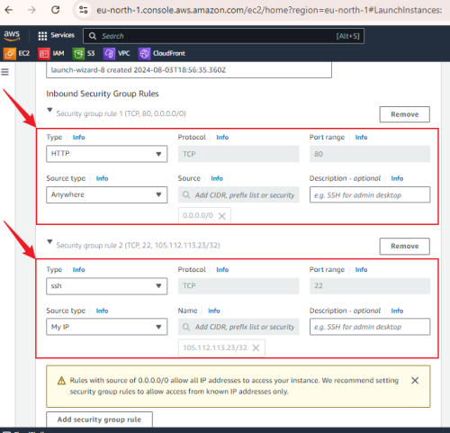
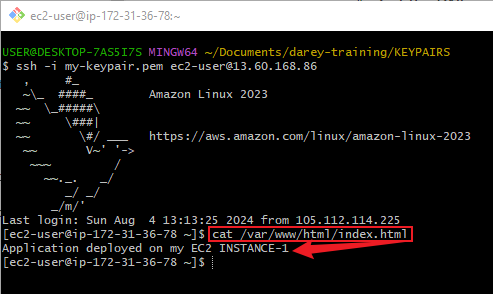

# Mini Project: Deploying Application Load Balancer (ALB) with Two EC2 Instances

## Purpose:
In this mini project, we will set up an Application Load Balancer (ALB) in AWS and deploy two EC2 instances behind it. This project will help understand the basics of load balancing and distributing traffic across multiple instances.

## Objectives:
Create Two EC2 Instances
Set Up ALB
Configure Target Group
Attach EC2 Instances to ALB
Test Load Balancing

## Task 1: Create Two EC2 Instances
**Action:**

1. **Log in to AWS Management Console:**
    - Navigate to the EC2 Dashboard.
    - Click on "Launch Instance."

2. **Configure the first EC2 instance:**
    - Add tags (e.g., Key: Name, Value: Instance-1).

    - Choose an Amazon Machine Image (AMI) (e.g., Amazon Linux 2).

    - Create or use an existing key pair to SSH into the instance.

- Configure security group:
    - Allow HTTP (port 80) from anywhere.
    - Allow SSH (port 22) from your IP address.
    

    - Review and launch the instance.
    

3. **Repeat the steps to create the second EC2 instance:**
- Ensure to use the same configuration and security group for the second instance.

**Purpose:**

Creating two EC2 instances will provide the backend servers that the ALB will distribute traffic to, ensuring high availability and fault tolerance.

## Task 2: Set Up Application Load Balancer (ALB)
**Action:**
**1. Navigate to the EC2 Dashboard:**
- Click on "Load Balancers" under the "Load Balancing" section.
- Click on "Create Load Balancer" and select "Application Load Balancer."

**2. Configure the ALB:**
- Name the ALB (e.g., My-ALB).
- Scheme: Internet-facing.

- IP address type: IPv4.
- VPC: Select the VPC used by your EC2 instances.

- Availability Zones: Select the VPC and subnets (ensure they cover multiple Availability Zones for high availability).

**3. Configure Security Groups & Routing:**
- Choose an existing security group or create a new one that allows HTTP (port 80) traffic.

- Create a new target group.

- Target group type: Instances.

- Name the target group (e.g., My-Target-Group).
- Protocol: HTTP.
- Port: 80.
- VPC: Select the VPC used by your EC2 instances.

- Refresh and select the newly created target group.

- Click "Next"

**4. Register Targets:**
- Select the two EC2 instances created in Task 1.
- Click on "Include as pending below"

**5. Review and Create:**
- Review all configurations and click "Create target group."

- Click on "Create load balancer."

**Purpose:**

Setting up the ALB allows you to distribute incoming traffic across multiple EC2 instances, improving the application’s availability and fault tolerance.

## Task 3: Configure Target Group
**Action:**
- Navigate to the EC2 Dashboard:
- Click on "Target Groups" under the "Load Balancing" section.
- Select the Target Group created in Task 2.
- Verify the health check settings.
- Ensure the target group is associated with the correct VPC and instances.

**ISSUE IDENTIFIED:**

At this point the "Health Status" indicates that both instances in the target group are "Unhealthy." This typically means the health checks are failing.

**SOLUTION:**

Here’s a step-by-step guide to resolve this issue.

**Verify Web Server Configuration**

Action:
- SSH into each EC2 instance.
- Ensure that a web server (e.g., Apache, Nginx) is installed and running.
- Check that the web server serves content on the specified health check path (e.g., /).

FIRST INSTANCE

    Install Apache (if not already installed)
    `sudo yum install httpd -y`

    Start Apache service
    `sudo service httpd start`

    Ensure Apache starts on boot
    `sudo chkconfig httpd on`

    Create a simple HTML page for health check
    `echo "Healthy" | sudo tee /var/www/html/index.html`

SECOND INSTANCE

 Install Apache (if not already installed)
    `sudo yum install httpd -y`

    Start Apache service
    `sudo service httpd start`

    Ensure Apache starts on boot
    `sudo chkconfig httpd on`

    Create a simple HTML page for health check
    `echo "Healthy" | sudo tee /var/www/html/index.html`

### Purpose:
The health checks fail if the web server is not running or not serving content on the health check path.

## Verify the health check settings again

**Purpose:**

Instances should be running without any underlying issues that could affect the health check response.

## Task 4: Attach EC2 Instances to Application Load Balancer (ALB)
**Action:**

1. **Navigate to the EC2 Dashboard:**
- Click on "Load Balancers" under the "Load Balancing" section.

2. **Select the ALB created in Task 2:**
- Go to the "Listeners" tab and click on "Manage rules/edit rules" under the HTTP listener.

- Ensure the default rule forwards traffic to the target group created in Task 2.

**Purpose:**

Attaching EC2 instances to the ALB ensures that incoming traffic is correctly routed to the backend instances.

## Task 5: Test Load Balancing
**Action:**

1. **Get the DNS name of the ALB:**
- Navigate to the EC2 Dashboard and click on "Load Balancers."
- Select the ALB and copy its DNS name.

2. **Test in a web browser:**
- Paste the DNS name into a web browser.
- Verify that you can access the application deployed on the EC2 instances.

## ISSUE IDENTIFIED:
- Here, the deployed application on my EC2 instance did not render on the web page when accessed using the DNS name of my Application Load Balancer (ALB).

**SOLUTION:**
- Verify Security Group Settings for ALB.

**Action:**

- Check the security groups associated with the ALB.

**Steps:**
- ALB Security Group:
    - Go to the EC2 Dashboard.
    - Select "Load Balancers" from the left-hand menu.
    - Select your load balancer (My-ALB).
    - Check the security group settings to ensure that it allows inbound HTTP (port 80) traffic from anywhere (0.0.0.0/0).
    

**Test in a web browser:**
- Paste the DNS name into a web browser.
- Verify that you can access the application deployed on the EC2 instances.

After ensuring the security group settings allow inbound HTTP (port 80) traffic from anywhere (0.0.0.0/0), as shown in the screenshot below:

The URL rendered the content of my EC2 instances as expected.

## NOTE: 
- You can also SSH into each instance and create a simple HTML page to verify traffic distribution (e.g., echo "Instance-1" > /var/www/html/index.html on the first instance and echo "Instance-2" > /var/www/html/index.html on the second instance).

- The screenshots display the content of the HTML file for each of my two instances. You can use the `sudo nano /var/www/html/index.html` command to add your content to the HTML file. This content will be shown when you test your application load balancer using its URL.

FIRST INSTANCE

SECOND INSTANCE

## Conclusion:
The mini project to deploy an Application Load Balancer (ALB) with two EC2 instances was successful, despite encountering and resolving several issues:

### Issue:

- **Unhealthy Instances:**
The initial health checks for the EC2 instances failed.
### Solution:

- Verified and installed the necessary web server software (Apache) on each instance.
- Ensured the web server was running and serving content on the specified health check path.
### Issue:

- **Failed Application Rendering:**
The deployed application did not render in the web browser when accessed using the ALB's DNS name.
### Solution:

- Verified and corrected the security group settings for the ALB to allow inbound HTTP (port 80) traffic from anywhere.

By addressing these issues, the ALB successfully distributed incoming traffic across the two EC2 instances, demonstrating improved availability and fault tolerance.

## Note:
For further verification, simple HTML pages were created on each instance to check traffic distribution. This confirmed that the ALB was correctly routing traffic to both instances.